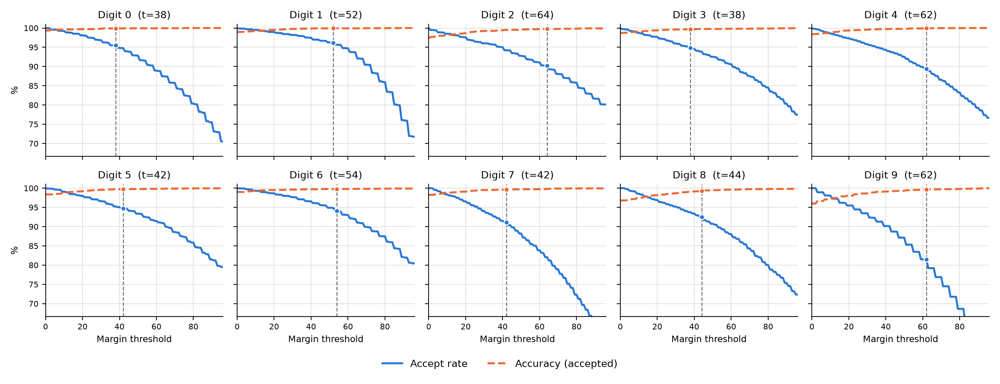
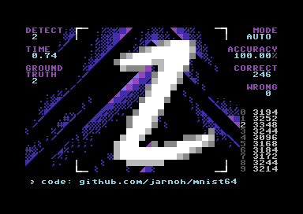

# MNIST64: Interactive speed 6502 implementation for 99.5% accuracy MNIST BNN on the Commodore 64

Jarno Heikkinen,<br>
Mindfield Defence Oy<br>
Source: https://github.com/jarnoh/mnist64  
Video: https://youtu.be/Z_S0IZenW_E

## Abstract

We present an 8-bit binary CNN for handwritten digit recognition on the stock Commodore 64: 64 kB RAM, 6502 CPU at 0.985248 MHz (PAL), no AI accelerator, and more interestingly, no multiply instruction.

The model reaches 99.42% accuracy on combined MNIST+EMNIST data set, or 99.53% with extra pass. A confidence-gated early exit routes 91.99% of images through a fast 0.544 s path, with fallback to a 1.748 s full path and an adaptive second (test-time-augmented) pass on the hardest 0.78% of all images; the deployed cascade matches full-network accuracy (99.42%) at an average 0.653 s per image.

## Introduction

Binarized neural networks (BNNs) [1] replace multiply-accumulate (MAC) operations with XNOR and popcount, trading arithmetic complexity for logical complexity at a small accuracy cost. This trade is normally exploited on modern hardware that still has multiply and SIMD instructions. We ask how much of it survives at the opposite extreme: a humble MOS 6502 introduced in 1975, which has no multiplier, no SIMD, and a clock under 1 MHz. Confidence-gated early exit [5] and test-time augmentation [6] are similarly well established as ways to trade average-case compute for accuracy on modern accelerators; we ask how the same adaptive-cascade idea pays off when every cycle is hand-counted assembly rather than a batch tensor operation.

This paper shows: (1) a fully binarized, 2-bit-input CNN reaches 99.42% accuracy (MNIST+EMNIST combined dataset) with a 20,852-byte model footprint, demonstrating that extreme quantization is compatible with near state-of-the-art accuracy even with no dedicated inference hardware; (2) a per-class confidence-gated early-exit and test-time-augmentation cascade, layered on that network, cuts average per-image inference time by roughly 60% (0.653 s vs. 1.748 s) while matching full-network accuracy; (3) hand-optimized 6502 machine-code techniques -- self-modifying operand patching, paired-lookup popcount tables, and split 8/16-bit accumulation -- make XNOR-popcount inference practical at interactive speed; and (4) all of the above, validated end-to-end on real, unmodified Commodore 64 hardware, recognizing digits from a floppy disk or user input.

Section [Model](#model) describes the model architecture; Sections [Early exit](#early-exit) and [Late exit](#late-exit) the early-exit and cascade operations; Section [Machine code](#machine-code) the 6502 implementation; and Section [Results](#results) the resulting accuracy and wall clock runtime measurements.

## Model

The full architecture is most compactly specified by the simplified training code:

```python
inp = tf.keras.Input((24, 24, 1), name="binary_pixels")
x = BinaryConv2D(32, 6, strides=2, padding="valid", use_bias=False, name="conv1")(inp)
x = BatchNormalization(momentum=0.9, name="conv1_bn")(x)
x = Sign(name="conv1_sign")(x)
x = BinaryConv2D(48, 4, strides=2, padding="valid", use_bias=False, name="conv2")(x)
x = BatchNormalization(momentum=0.9, name="conv2_bn")(x)
x = Sign(name="conv2_sign")(x)
x = Flatten()(x)
x = BinaryDense(128, use_bias=False, name="hidden")(x)
x = BatchNormalization(momentum=0.9, name="hidden_bn")(x)
x = Sign(name="hidden_sign")(x)
logits = Dense(10, name="output")(x)
```

During the forward pass, the `BinaryConv2D`, `BinaryDense`, and `Sign` binarize layer weights and activations to ±1. This prevents normal gradient calculations during training, so the backward pass uses a surrogate gradient of magnitude-aware differentiation (MAD), defined as max(0, 1−|x|) [2].

The 24x24 input is center-cropped from 28x28, quantized to two bits for a total of 144 bytes/image. The resulting network performs 608,000 weight-activations.

The stored learned parameters occupy 20,852 bytes: 192 `conv1` (note: alignment of 8) + 3,072 `conv2` + 12,288 `hidden` + 4,000 `early_output` + 1,280 `output` bytes of weights, and 20 bytes of full-network `output` state. The production inference code, buffer, and data footprint is 37,192 bytes, including 8,064 bytes of dedicated lookup-table regions for bitpacking and paired popcount, excluding test images, labels, and verification payloads.

## Training

Model training uses the Adam optimizer (lr=1e-3, loss=`SparseCategoricalCrossentropy`, metrics=`accuracy`). The deployed model uses a `CosineDecay` learning-rate schedule (1e-3..1e-6) over the full run and restoring best weights as a backstop. Training was run for the complete 400-epoch schedule without early-stopping, batch size 128.

The dataset for the model was combined MNIST [3] (4x repeat for balancing) + EMNIST Digits [4], with random translation (±1.5px) and gamma (1.0±0.3), both applied only to the training partition after splitting. Test sets are kept separate, using each dataset's own split, and we verified the pixel-level uniqueness of images across the sets. Model parameters are learned exclusively from the training partition.

## Early exit

The full model is expensive, and the `conv1` layer typically makes a good guess of the classification.  We train an early head model for detecting if early exit can be taken with decent accuracy, and if not, we fall back to the full model, loosely following the confidence-gated early-exit cascade pattern of [5], but we are using per-class thresholds, and we train the early model separately from frozen trunk.  The early head's `early_output` weights are binarized with a Gaussian ($\sigma$=1) $\exp(-x^2/2)$ gradient, which seemed to work better than MAD here, maybe because it never fully vanishes near the clip boundary, so saturated weights can keep adjusting.  The early head model is defined as:

```python
trunk = tf.keras.Model(full.input, full.get_layer("conv1_sign").output)
trunk.trainable = False
x = Flatten()(trunk(inp, training=False))
logits = BinaryDense(10, use_bias=True, name="early_output")(x)
```

The early head uses a 3,200-bit `conv1` output and 10 class-score rows (4,000 weight bytes). Early exit is taken when the winner is over a per-class threshold. Thresholds were chosen with a Lagrangian fit for speed and accuracy, using the validation data split.



## Late exit

Late test-time augmentation (TTA) is added as an adaptive tier via a gated second pass with full model, this time image is shifted up 1 pixel. We simply sum two passes' scores. With TTA, we have a relatively cheap way to scale performance and accuracy while running. In addition to normal gate [6], we added similar winner per-class confidence-margin trigger used by our early exit.

| Class | 0 | 1 | 2 | 3 | 4 | 5 | 6 | 7 | 8 | 9 | Total |
|---|---:|---:|---:|---:|---:|---:|---:|---:|---:|---:|---:|
| Margin threshold | 335 | 546 | 348 | 111 | 469 | 167 | 325 | 354 | 362 | 396 | -- |
| Accept rate | 92.31% | 82.84% | 90.27% | 94.48% | 88.61% | 95.95% | 88.85% | 90.16% | 87.08% | 90.99% | 90.26% |

Per-class late-TTA margin thresholds: the full-network score margin below which the shifted second pass is triggered for each winning class, and the percentage of images accepted without the second pass

## Machine code

The model needs no multiplication, enabling us to use 6502 bit operations.  The dot product of binary matrices is implemented as XNOR (`eor` instruction in self-modified "speedcode"-style) and popcount (bit count lookup) operations.

```assembly
    lda WEIGHTS+off,Y // 4 cycles - load weight from absolute address
    eor #$cc          // 2 cycles - exclusive-or activation (self-modified while running)
    tax               // 2 cycles - copy result to table index register
    lda popcount,X    // 4 cycles - lookup table 8-popcount
    adc zp_sum        // 3 cycles - intermediate 8-bit sum from zeropage variable
    sta zp_sum        // 3 cycles - store sum back
                      // 18 total
```

The key insight in this code is that activation values get re-used over the weights, which allows us to patch them once into the code, opposite to having two pointers.  This trick saves us 2 cycles, which adds up as this is the workhorse of the whole inference, 84,640 iterations.

Another party trick is the patching code for `conv1`, which updates the self-modifying values above.  There we run two popcounts in parallel, implemented as another lookup table of size 64x64 ($2^6$ from the kernel width).  You might have wondered why we used kernel width that is not 8 (we use 6, and it leaves two bits free on table each row).  Apart from model training nicely, here are two reasons in implementation side: the two free bits keep `stride=2` phases cheaper, and with bigger sizes the size of lookup table would grow.  The offset into this lookup table is directly patched inside `conv1`'s innerloop, replacing the standard popcount table.
For other layers, we implemented pair-popcount lookups 9×256 that saves one `ADC` instruction per pair of bytes, providing 5% speedup.

```text
// c1_kw = 6; the subtraction does the NOT part in XNOR.
c1_pair[p0][p1] = (c1_kw - popcount(weight ^ p0)) + 2*(c1_kw - popcount(weight ^ p1))
```

The code was unrolled and inlined as much as the memory budget allowed.
Significant effort was put into manual optimization, such as splitting partial sums to codepaths that can be summed into an 8-bit register and only later summed to 16-bit totals.  The alignment of  tables is carefully designed to prevent penalties (+1 cycles of page crossing), and instead of counting to 8 we use a sentinel bit to minimize the instruction count.

## Results

With early-exit and TTA, we have multiple options for adjusting accuracy during runtime.  If you can wait 4 seconds, the full network + TTA delivers combined dataset accuracy of 99.53%, or you can get a fast response in 0.544 s that is up to 98.08% correct, or other combinations in the runtime metrics below.

Previous work, NES-based MNIST running on 6502 1.79MHz CPU, has 6,560 connections, uses about 5 million cycles, and achieves only 93.11% accuracy [7]. Their performance results are explained by the use of Woz's generic floating point emulation library [8].

| Metric | Accuracy | Correct | Total |
|---|---:|---:|---:|
| Combined early acceptance | 91.99% | 45,995 | 50,000 |
| Combined accuracy among accepted | 99.72% | 45,867 | 45,995 |
| MNIST early-head | 97.55% | 9,755 | 10,000 |
| EMNIST Digits early-head | 98.22% | 39,287 | 40,000 |
| Combined early-head | 98.08% | 49,042 | 50,000 |
| MNIST full-network | 99.28% | 9,928 | 10,000 |
| MNIST full-network + TTA | 99.49% | 9,949 | 10,000 |
| EMNIST Digits full-network | 99.45% | 39,780 | 40,000 |
| EMNIST Digits full-network + TTA | 99.54% | 39,817 | 40,000 |
| Combined full-network | 99.42% | 49,708 | 50,000 |
| Combined full-network + TTA | 99.53% | 49,766 | 50,000 |
| Combined cascade (early exit + full, no late TTA) | 99.34% | 49,672 | 50,000 |
| Combined deployed cascade (+ late TTA) | 99.42% | 49,708 | 50,000 |
| MNIST deployed cascade | 99.35% | 9,935 | 10,000 |
| EMNIST Digits deployed cascade | 99.43% | 39,773 | 40,000 |

| Metric | Cycles | Runtime (s) |
|---|---:|---:|
| Early exit | 536,031 | 0.544 |
| Fallback tail | 1,186,202 | 1.204 |
| Full total | 1,637,851 | 1.662 |
| Fallback total (early exit + fallback tail, reusing `conv1`) | 1,722,233 | 1.748 |
| Late-TTA extra (when triggered) | 1,640,333 | 1.665 |
| Weighted average (deployed cascade) | 643,840 | 0.653 |

The full network performs 608,000 weight-activations per image, and with the 1.662 s full-path runtime that is approximately 365,742 ops/s or 0.00000037 TOPS.  Timings were made with VIC-II display enabled (with badline penalties) and averaged over 10 images.

The weighted average applies the early-exit rate, the fallback rate, and the late-TTA trigger rate to these measured per-path costs: $0.9199 \times 0.544 + 0.0723 \times 1.748 + 0.0078 \times (1.748 + 1.665) = 0.653$ seconds.

| Layer | Cycles | Runtime (s) | Share of total |
|---|---:|---:|---:|
| Conv1 | 451,650 | 0.458 | 27.6% |
| Conv2 | 935,770 | 0.950 | 57.1% |
| Hidden | 228,928 | 0.232 | 14.0% |
| Output | 20,572 | 0.021 | 1.3% |
| Argmax | 879 | 0.001 | 0.1% |
| TTA gate | 52 | 0.000 | &lt;0.1% |
| Total (one full-network pass) | 1,637,851 | 1.662 | 100% |

Convolutional layers make up majority of the runtime cost. The per-class early-exit and late-TTA margin thresholds were recalibrated together to the tightest early-exit acceptance rate, so that the time budget could be spent on late-TTA coverage of the hardest fallback images.

Finally, the inference code was combined with user interface and a floppy disk loading using Spindle loader [9], which transparently decompresses data on the fly from the 170kB floppy disks. Resulting program allows easy access to test data set and user can also input their own digits using mouse or joystick.



## Future work

Because of 64kB limitations available for whole app, we had to be selective on the unrolled code. Weights are expensive, so tinkering with different layers and weight storage can unlock further potential.  Using different kernel width could have potential, as the current width of 6 is not using all XNOR-popcount operations available.

We also challenge you to improve these results. With modern methods, we have now exceeded LeCun et al.'s 1998 accuracy (MNIST images 9,930 correct, ours 9,949) [3], on a computer from 1982, so perhaps we can again move the needle a few years forward?

## Conclusions

The 6502 seems to be well suited for advanced tasks, we envision that most of the current image processing subsystems could be replaced with C64-based solutions.

## Citation

```bibtex
@misc{mnist64,
  author       = {Jarno Heikkinen},
  title        = {MNIST64: Interactive Speed 6502 Implementation for 99.5\% {MNIST} {BNN} on the {Commodore 64}},
  year         = {2026},
  institution  = {Mindfield Defence Oy},
  note         = {Preprint},
  url          = {https://github.com/jarnoh/mnist64}
}
```

## References

1. M. Courbariaux, I. Hubara, D. Soudry, R. El-Yaniv, and Y. Bengio, "Binarized Neural Networks: Training Deep Neural Networks with Weights and Activations Constrained to +1 or -1," *Advances in Neural Information Processing Systems 29 (NeurIPS 2016)*. [arXiv:1602.02830](https://arxiv.org/abs/1602.02830).
1. C. Sakr, S. Dai, R. Venkatesan, B. Zimmer, W. J. Dally, and B. Khailany, "Optimal Clipping and Magnitude-aware Differentiation for Improved Quantization-aware Training," *Proceedings of the 39th International Conference on Machine Learning (ICML 2022)*, PMLR 162, 2022. [arXiv:2206.06501](https://arxiv.org/abs/2206.06501).
1. Y. LeCun, L. Bottou, Y. Bengio, and P. Haffner, "Gradient-Based Learning Applied to Document Recognition," *Proceedings of the IEEE*, vol. 86, no. 11, pp. 2278--2324, 1998. [doi:10.1109/5.726791](https://doi.org/10.1109/5.726791).
1. G. Cohen, S. Afshar, J. Tapson, and A. van Schaik, "EMNIST: An Extension of MNIST to Handwritten Letters," *2017 International Joint Conference on Neural Networks*, pp. 2921--2926, 2017. [doi:10.1109/IJCNN.2017.7966217](https://doi.org/10.1109/IJCNN.2017.7966217).
1. S. Teerapittayanon, B. McDanel, and H. T. Kung, "BranchyNet: Fast Inference via Early Exiting from Deep Neural Networks," *2016 23rd International Conference on Pattern Recognition (ICPR)*, pp. 2464--2469, 2016. [doi:10.1109/ICPR.2016.7900006](https://doi.org/10.1109/ICPR.2016.7900006).
1. L. Mocerino, R. G. Rizzo, V. Peluso, A. Calimera, and E. Macii, "Adaptive Test-Time Augmentation for Low-Power CPU," 2021. [arXiv:2105.06183](https://arxiv.org/abs/2105.06183).
1. C. Guida and L. Demaio, "The Nintendo Artificial Neural Network System," *CEUR Workshop Proceedings*, vol. 4090, 2025. https://ceur-ws.org/Vol-4090/short7.pdf.
1. R. Rankin and S. Wozniak, "Floating Point Routines for 6502," *Dr.Dobb's Journal of Computer Calisthenics and Orthodontia*, August 1976. https://6502.org/documents/periodicals/dr_dobbs_journal/selected_articles/floating_point_routines_for_the_6502.pdf.
1. L. Åkesson, "Spindle v3: An integrated linking, loading and decrunching solution for C64 trackmos", Gubbdata 2021. https://www.linusakesson.net/software/spindle/v3.php.
